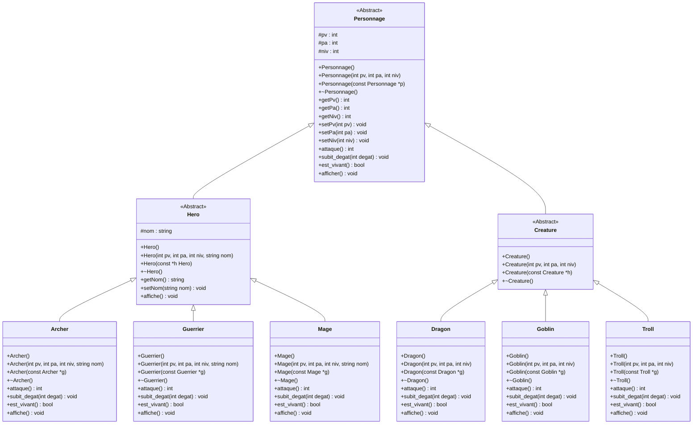

# POO-prosit_4

# Diagramme de classe

```mermaid
classDiagram

    class Personnage{
        <<Abstract>>
        #pv : int
        #pa : int
        #niv : int
        +Personnage()
        +Personnage(int pv, int pa, int niv)
        +Personnage(const Personnage *p)
        +~Personnage()

        +getPv() int
        +getPa() int
        +getNiv() int

        +setPv(int pv) void
        +setPa(int pa) void
        +setNiv(int niv) void

        +attaque() int
        +subit_degat(int degat) void
        +est_vivant() bool
        +afficher() void
    }

    class Hero{
        <<Abstract>>
        #nom : string
        +Hero()
        +Hero(int pv, int pa, int niv, string nom)
        +Hero(const *h Hero)
        +~Hero()

        +getNom() string

        +setNom(string nom) void

        +affiche() void
    }

    class Guerrier{
        +Guerrier()
        +Guerrier(int pv, int pa, int niv, string nom)
        +Guerrier(const Guerrier *g)
        +~Guerrier()

        +attaque() int
        +subit_degat(int degat) void
        +est_vivant() bool
        +affiche() void
    }

    class Archer{
        +Archer()
        +Archer(int pv, int pa, int niv, string nom)
        +Archer(const Archer *g)
        +~Archer()

        +attaque() int
        +subit_degat(int degat) void
        +est_vivant() bool
        +affiche() void
    }

    class Mage{
        +Mage()
        +Mage(int pv, int pa, int niv, string nom)
        +Mage(const Mage *g)
        +~Mage()

        +attaque() int
        +subit_degat(int degat) void
        +est_vivant() bool
        +affiche() void
    }

    class Creature{
        <<Abstract>>
        +Creature()
        +Creature(int pv, int pa, int niv)
        +Creature(const Creature *h)
        +~Creature()
    }

    class Dragon{
        +Dragon()
        +Dragon(int pv, int pa, int niv)
        +Dragon(const Dragon *g)
        +~Dragon()

        +attaque() int
        +subit_degat(int degat) void
        +est_vivant() bool
        +affiche() void
    }

    class Goblin{
        +Goblin()
        +Goblin(int pv, int pa, int niv)
        +Goblin(const Goblin *g)
        +~Goblin()

        +attaque() int
        +subit_degat(int degat) void
        +est_vivant() bool
        +affiche() void
    }

    class Troll{
        +Troll()
        +Troll(int pv, int pa, int niv)
        +Troll(const Troll *g)
        +~Troll()

        +attaque() int
        +subit_degat(int degat) void
        +est_vivant() bool
        +affiche() void
    }

Personnage<|--Hero
Personnage<|--Creature

Hero<|--Archer
Hero<|--Guerrier
Hero<|--Mage

Creature<|--Dragon
Creature<|--Goblin
Creature<|--Troll
```